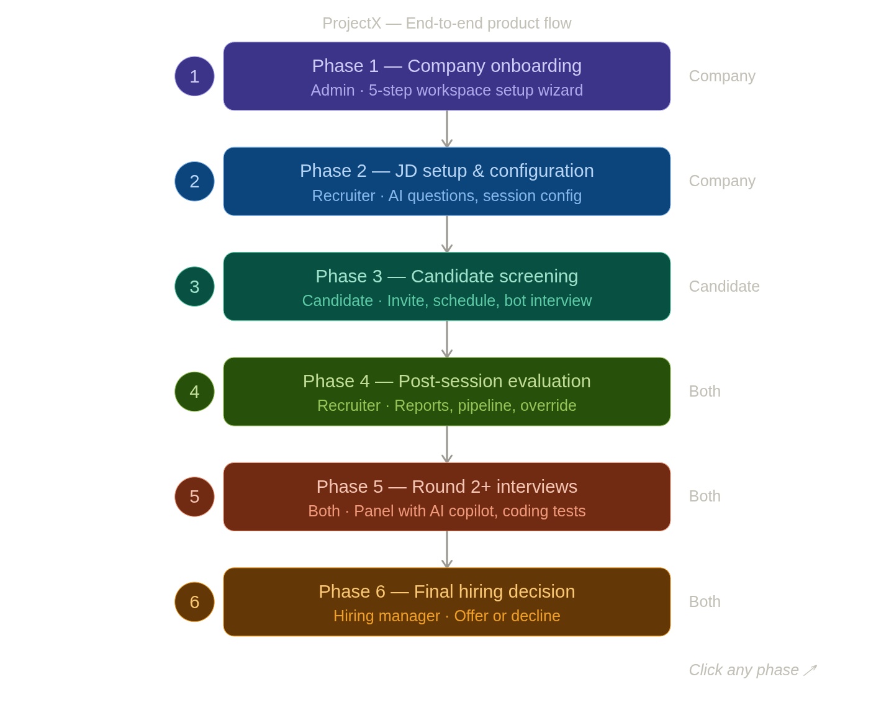

# ProjectX

# AI Interview Platform

This document provides a comprehensive overview of the AI Interview Platform — a SaaS product designed to automate and intelligently manage the end-to-end candidate screening and interview process for enterprise clients.

---

# 1. Product Overview

## What Is It?

The AI Interview Platform is an enterprise-grade SaaS solution that automates candidate screening using AI-led video interviews (camera and microphone required from candidates). It integrates directly with existing Applicant Tracking Systems (ATS), generates tailored question banks per role and project scope, conducts live proctored interviews at scale, and delivers detailed candidate evaluation reports — all with configurable human oversight.

## Who Is It For?

The platform is designed for large enterprise organisations — such as Google, Accenture, and similar Fortune 500 companies — that run high-volume hiring processes and need a scalable, consistent, and auditable screening layer before human interviewers are involved.

**Primary users:**

- Recruiting teams and HR administrators who configure and manage interview pipelines
- Hiring managers who review candidate reports and make advancement decisions
- Human interviewers who participate in panel sessions with AI co-pilot support

## The Problem It Solves

Traditional candidate screening at enterprise scale relies on recruiter phone screens — a manual, time-intensive process where a single recruiter may conduct 50+ screening calls per week across multiple open roles. This creates three core problems: it is slow (bottlenecks the pipeline), inconsistent (quality depends on the recruiter), and unscalable (headcount required grows linearly with hiring volume).

The AI Interview Platform replaces the phone screen with a structured, AI-led video interview — consistent, available 24/7, capable of running hundreds of sessions simultaneously, and producing richer candidate intelligence than a recruiter note ever could.

## Core Value Proposition

- **Scale:** Run 500+ simultaneous live interview sessions without additional headcount
- **Consistency:** Every candidate is evaluated against the same rubric, reducing inconsistency from ad hoc phone screens
- **Depth:** Dynamic AI probing extracts deeper evidence from candidates rather than accepting surface-level answers
- **Contextual intelligence:** Question banks are generated from a rich four-layer context stack — not generic question templates
- **Auditability:** Detailed reports with transcripts, per-question scores, and proctoring logs support defensible hiring decisions
- **Brand alignment:** Fully configurable AI avatar and session panel so the experience matches the client's brand

---

# Product Flow

ProjectX automates candidate screening via AI-led video interviews. A company connects their ATS, sets up a job posting, and ProjectX handles screening at scale — surfacing the strongest candidates for human review and decision.

The diagram below maps the complete end-to-end flow across 6 phases, from initial setup through to the final hire decision.

---

## Phase 1 — Company Onboarding

**Who:** Company Admin · **Time:** ~10 minutes · **One-time setup**

The admin is invited to ProjectX and walks through a 5-step guided wizard to configure the workspace before any hiring activity begins.

**What happens:**

- Authenticates via SSO (Google Workspace or Microsoft) or work email — no new password
- Fills in company profile: name, industry, size, and a culture brief that the AI uses to personalise interview questions
- Connects their ATS using API credentials — each ATS uses a different method (Ceipal uses OAuth2 access token + base URL; Greenhouse uses REST API; Workday uses Client ID + Secret)

> ⚠️ **Ceipal has no webhooks.** The integration is polling-only. There is no webhook URL to generate. The admin enters their Ceipal API key and base URL, clicks Test Connection, and ProjectX begins polling the Ceipal REST API every 15 minutes as the sole sync mechanism.
> 
- Invites team members and assigns roles: Recruiter, Hiring Manager, Interviewer, or Observer
- Sets notification preferences for key events (session completed, borderline reviews, expiring invites)

> 💡 ATS connections are **API-based**. Each ATS has a dedicated Adapter in ProjectX's backend, meaning a new ATS integration only requires a new adapter — the core pipeline never changes.
> 

---

## Phase 2 — JD Setup & Configuration

**Who:** Recruiter + Hiring Manager · **Triggered by:** New job posted in ATS

When a job is posted in the ATS, it auto-appears on the ProjectX dashboard with a "Needs Setup" badge. The recruiter then configures everything the AI needs to run a sharp, role-specific interview.

**What happens:**

- AI analyses the JD and extracts must-have skills, nice-to-haves, red flags, and suggests JD improvements if it's vague
- Recruiter configures the candidate profile: experience range, soft skill priorities, and dealbreakers
- AI generates a question bank of 8–10 questions calibrated for a 10–15 minute session — each question includes its signal intent, depth level, and follow-up triggers
- Recruiter and HM review, edit, and mark mandatory questions
- Session is configured: interview type (Bot / Human Panel / Coding), duration, bot tone, scoring thresholds (Passed / Borderline / Rejected), and invite settings
- Job is activated — candidates receive invites as the ATS syncs their applications

> 💡 Questions are generated from a **4-layer context stack**: the job description, company profile, candidate brief, and an optional project brief the recruiter uploads. They are never generic templates.
> 

---

## Phase 3 — Candidate Screening

**Who:** Candidate + (optional) human participants · **Duration:** 10–15 minutes

Each candidate receives a branded, personal invite and completes a live AI-led video interview at a time of their choosing.

**What happens:**

- Candidate receives a branded email + SMS with a JWT-signed scheduling link (expires in 72 hours)
- They pick a time slot from the recruiter's defined availability window — a calendar invite is sent automatically
- On joining, they complete a pre-check: **camera test**, mic test, identity confirmation, and OTP verification
- The video interview begins — camera and mic are both required throughout
- The AI bot ("Alex") conducts the session: asks questions, listens actively, and dynamically probes shallow or vague responses
- Session progress is tracked (e.g. Q3 of 9, 11 min remaining) and displayed throughout

**Session interface:** A 2×2 video grid (candidate, AI bot, human participant if present, empty slot). An AI Copilot panel renders automatically for any human (non-candidate) in the session — always-on, never optional.

**AI Copilot panel** (visible to all human participants):

- Live transcript with speaker labels
- Real-time signal cards per exchange (depth, specificity, evidence quality)
- The bot’s next planned probe — shown before it fires
- Question coverage tracker (which mandatory questions remain)

**Human participants** (supervisor, recruiter, or HM): Can join as full video participants, visible to the candidate. They see the Copilot panel but cannot redirect the bot or intervene mid-session. They can flag timestamped moments for the post-session report.

---

## Phase 4 — Post-Session Evaluation

**Who:** Recruiter + Hiring Manager · **Triggered by:** Session completion

Within minutes of a session ending, the recruiter is notified and a full evaluation report is ready. The report has two layers.

**High-level overview** (for a fast read):

- Score out of 100 + classification: **Passed**, **Borderline**, or **Rejected**
- 3–5 sentence AI narrative summary of the candidate
- Key strengths and gaps flagged for probing in the next round
- Timestamped standout moments — clickable to jump to that point in the recording

**Detailed report** (for deep review):

- Per-question score cards: response summary, detected signals, and AI probe sub-cards
- Full searchable transcript with speaker labels
- Complete session recording

Human override is always available — the recruiter or HM can confirm, reject, or flag any candidate regardless of the AI classification. **Borderline candidates are always held for human review** — they cannot be auto-advanced or auto-rejected.

The pipeline kanban board updates in real time. Candidate cards move between stages and the funnel (Applied → Screened → Passed → Round 2 → Finalists) refreshes automatically.

---

## Phase 5 — Round 2+ Interviews

**Who:** Recruiter + Interviewers + Candidate · **Triggered by:** Recruiter advancing a candidate

When a candidate is moved to Round 2, the recruiter picks the session type, assigns interviewers, and the AI automatically pre-seeds the question bank using weak signals from Round 1.

**Human Panel interview:**

- Interviewers join a video call and lead the session
- An AI Copilot panel (invisible to the candidate) shows: live transcript, real-time signal detection, dynamic follow-up suggestions with rationale, and a question coverage tracker
- Suggestions are passive — interviewers choose whether to use them
- After the session, each interviewer submits a structured verdict. The Round 2 report combines their input with the session transcript and AI signals.

**Coding interview:**

- A shared live IDE is added to the video call
- AI tracks approach (planning vs. diving in), code quality, time complexity, and how well the candidate verbalises their reasoning
- All signals are captured in the Round 2 coding report

> 💡 The Round 2 question bank is **automatically pre-seeded** from Round 1 gaps. Weak signals from screening become targeted questions — no recruiter needs to manually carry this over.
> 

---

## Phase 6 — Final Hiring Decision

**Who:** Hiring Manager · **Triggered by:** All rounds completed

The hiring manager sees a single consolidated candidate card aggregating every round — scores, recordings, reports, and individual interviewer verdicts. The AI produces a final recommendation with reasoning and a composite score.

**What happens:**

- HM reviews all rounds in one view: per-round scores, session recordings, and interviewer verdicts
- AI final recommendation shown — composite score + synthesis of signals across all rounds
- HM makes the call — **Offer** or **Decline** — in one click
    - **Offer:** Recruiter notified to proceed; Ceipal status updated automatically
    - **Decline:** Candidate notified (templated or personalised); Ceipal status updated

**Daily recruiter dashboard** surfaces action items proactively each morning: borderline reviews awaiting decision, invites expiring soon, today's live sessions, new reports ready, and pipeline health per open role — so nothing falls through the cracks.

---